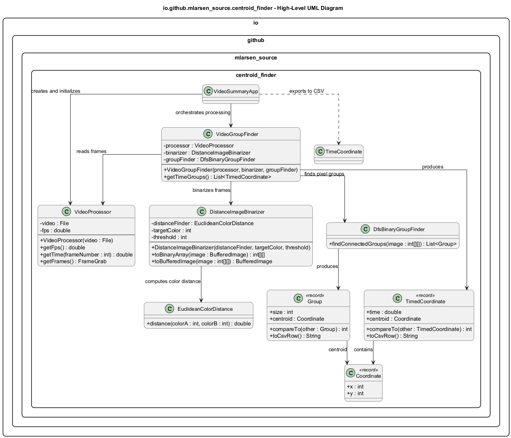
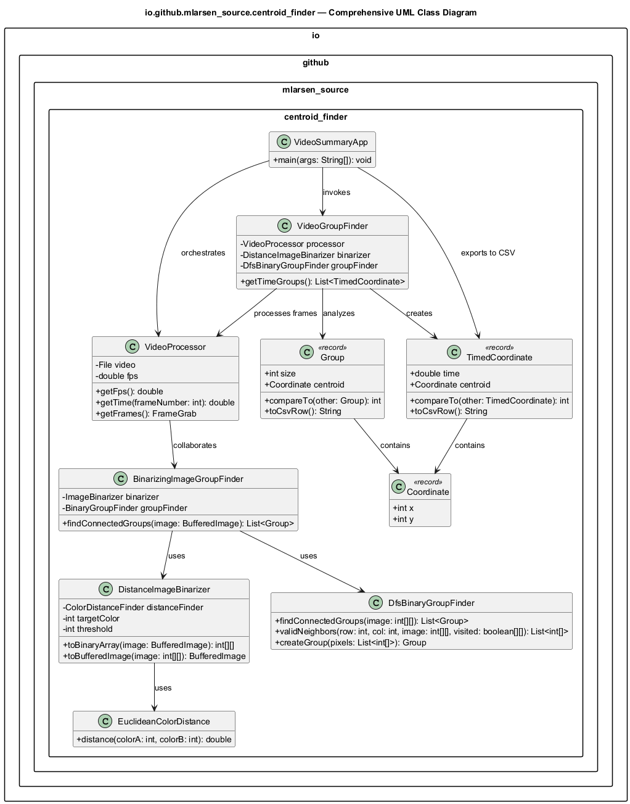

# Centroid Finder Video Part II Plan:

## 1. Implement a new TimedCoordinate Record

* Represent the centroid position captured at a specific time in a video or image sequence.
* Store the timestamp (double time) and a Coordinate (int x, int y).
* Implement Comparable, allowing sorting by time in ascending order.
* Provide a toCsvRow() method that formats output as time,x,y for CSV export.

## 2. Implement a new VideoProcessor Class

* Use the JCodec library to process an MP4 video file.
* Calculate frames per second (FPS) from total frames and duration.
* Convert frame indices into timestamp values in seconds.
* Create a FrameGrab object for accessing individual frames of the input video.
* Provides video data and FrameGrab object to other classes.

## 3. Implement a new VideoGroupFinder Class
* Instantiate a new empty ArrayList of TimedCoordinate Records.
* Iterate through each frame within FrameGrab object provided by a VideoProcessor.
* Use DistanceImageBinarizer class to create 2D binary array of the frame.
* Use BinarizingImageGroupFinder class to create an ArrayList of Group Records found within the frame.
* Extract coordinates from largest Group Record in the ArrayList of Group Records.
* Get the frame time from start from the VideoProcessor class.
* Create a new TimedCoordinate Record containing the largest Group coordinates and the frame time from start
* Append newly created TimedCoordinate Record to the ArrayList of TimedCoordinate Records.
* Return the ArrayList containing all of the TimedCoordinate Records.

## 4. Implement a new VideoSummaryApp Application
 
* Accept command-line arguments:
  
  1. The path to an input mp4 file.
  2. The path to an output csv file.
  3. A target hex color in the format RRGGBB.
  4. An integer threshold for binarization.
   
* Perform appropriate data quality validation and data cleansing steps needed on all input arguments.
* Perform frame by frame analysis of mp4 video.
* Binarize each frame by comparing each pixel's Euclidean color distance to the target color.
* Combine the largest connected group coordinates located within each frame with the frame timestamp in a TimedCoordinate Record.
* Collect all of the TimedCoordinate Records identified in the mp4 video into an ArrayList.  
* Write a CSV file named "output.csv" containing one row per TimeCoordinate Record in the format "time,x,y".

## 5. Implement Tests for new classes/methods/behavior
  * VideoProcessorTest Class
    * getFPS()
    * getTime()
    * getFrames()

  * VideoGroupFinderTest Class
    * getTimeGroups

## 6. Use Maven to create an executable JAR
  *  Utilize Maven Assembly Plugin to create executable JAR

## 7. Validate that code is accurately tracking the salamander
We had AI make a sample video for us. The video included a white background with an orange salamander slowly moving around the screen. The video also had a number of smaller groups of the same color to make sure we were tracking the right group. Additionally the video had x/y coordinates of the salamander centroid. We ran this video through our program and upon analyzing our results, we could see that at all times, our csv file accurately reported the location of the salamander centroid.

To choose a good color and threshold for our app, we extracted individual frames from the sample ensantina salamander video using JCodec and then using color picking tools we collected a number of different hex values from the salamander pixels as well as the background pixels.  We then utilized AI to assist us in evaluating all of the different color values that we collected in order to determine the best color and threshold value we should use in order to produce the best results.     

## Diagrams:

