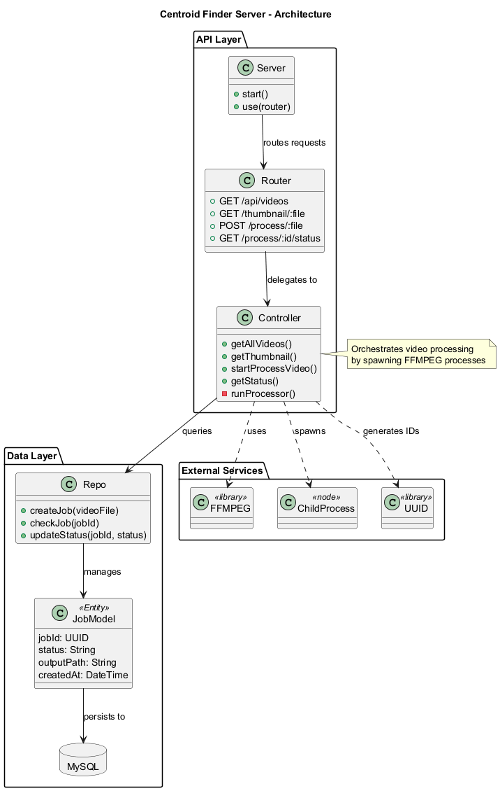
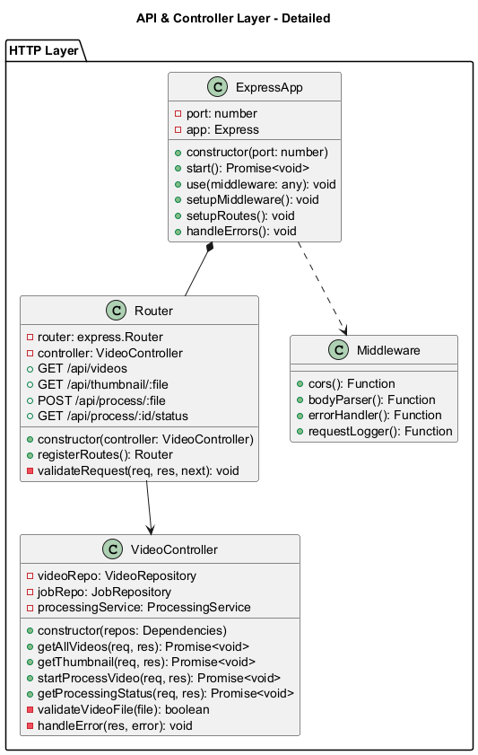
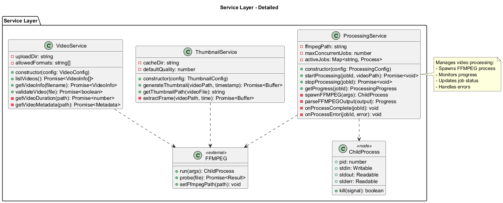
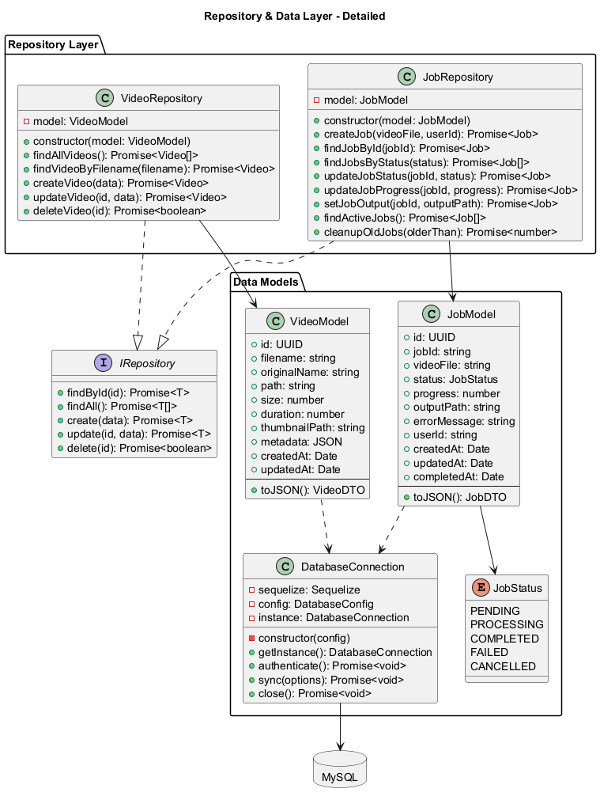

# Server Plan

## 1. Create Express App

* Reorder file structure
* Intall express and other dependencies

## 2. Setup a connection to a db

* Use mysql2 with phpMyAdmin
* use ORM sequelize
* Crete neccesary schema and repo layer


## 3. Build Express Server

* Configure .env file
* Create all routes for salamander API
* Implement neccesary middleware

# Required Routes

* GET /api/videos
* GET /thumbnail/{filename}
* POST /process/{filename}
* GET /process/{jobId}/status


## List Available Videos

**GET** `/api/videos`

**Description:**  
Return a list of all video files in the mounted directory, available publicly at /videos/VIDEOS_NAME.

**Responses:**

- **200 OK**

  ```json
  ["intro.mp4", "demo.mov"]
  ```

- **500 Internal Server Error**

  ```json
  {
    "error": "Error reading video directory"
  }
  ```

---

## Generate Thumbnail

**GET** `/thumbnail/{filename}`

**Path Parameters:**

- `filename` (string, required) — Name of the video file (e.g. `demo.mov`)

**Description:**  
Extract and return the first frame from the video as a JPEG.

**Responses:**

- **200 OK**  
  JPEG binary data  
  _Content-Type: image/jpeg_


- **500 Internal Server Error**

  ```json
  {
    "error": "Error generating thumbnail"
  }
  ```

---

## Start Video Processing Job

**POST** `/process/{filename}`  
_Query parameters:_ `?targetColor=<hex>&threshold=<int>`

**Path Parameters:**

- `filename` (string, required) — Name of the video file to process (e.g. `intro.mp4`)

**Query Parameters:**

- `targetColor` (string, required) — Hex color code to match (e.g. `ff0000`)
- `threshold`   (number, required) — Match threshold (e.g. `120`)

**Description:**  
Kick off an asynchronous job to analyze the video. Returns a `jobId` you can poll.

**Responses:**

- **202 Accepted**

  ```json
  {
    "jobId": "123e4567-e89b-12d3-a456-426614174000"
  }
  ```

- **400 Bad Request**

  ```json
  {
    "error": "Missing targetColor or threshold query parameter."
  }
  ```


- **500 Internal Server Error**

  ```json
  {
    "error": "Error starting job"
  }
  ```

---

## Get Processing Job Status

**GET** `/process/{jobId}/status`

**Path Parameters:**

- `jobId` (string, required) — ID returned by the **POST** `/process` call

**Description:**  
Check whether the job is still running, has completed, or failed.

**Responses:**

- **200 OK** (processing)

  ```json
  {
    "status": "processing"
  }
  ```

- **200 OK** (done)

  ```json
  {
    "status": "done",
    "result": "/results/intro.mp4.csv"
  }
  ```

- **200 OK** (error)

  ```json
  {
    "status": "error",
    "error": "Error processing video: Unexpected ffmpeg error"
  }
  ```

- **404 Not Found**

  ```json
  {
    "error": "Job ID not found"
  }
  ```

- **500 Internal Server Error**

  ```json
  {
    "error": "Error fetching job status"
  }
  ```

## Diagrams:






